### 一步一个脚印，打造丰富，易于二开的表单 
此项目已经广泛应用于[之奇OA](https://github.com/ziqiflow/ziqiflowOA)项目中

目标
    - 更多的扩展插件
    - 低代码平台


- [DEMO展示](#demo展示)
- [快速开始](#快速开始)
  - [引入方式](#引入方式)
    - [1.cdn引入](#1cdn引入)
    - [2.npm install 方式安装](#2npm-install-方式安装)
  - [DEMO展示](#demo展示-1)
- [界面介绍](#界面介绍)
  - [拖拉拽](#拖拉拽)
  - [丰富的组件](#丰富的组件)
  - [单组件公共字段](#单组件公共字段)
  - [针对组件个性化的设置](#针对组件个性化的设置)
  - [计算公式](#计算公式)
- [组件介绍](#组件介绍)
  - [插槽组件](#插槽组件)
  - [默认值的填写](#默认值的填写)
  - [参数](#参数)
  - [功能如何实现？？？](#功能如何实现)
    - [数据填充](#数据填充)
    - [属性变更](#属性变更)
- [高级功能（供开发者使用）](#高级功能供开发者使用)
  - [button组件的点击click事件](#button组件的点击click事件)
  - [内置参数-高级](#内置参数-高级)
  - [全局表单变更触发器](#全局表单变更触发器)
  - [handle函数参数介绍](#handle函数参数介绍)
  - [如何制作自定义组件](#如何制作自定义组件)
    - [编写组件](#编写组件)
- [附录](#附录)
  - [参数介绍](#参数介绍)

## DEMO展示
[点击这里](https://ziqiflow.flycore.cn/form-generater/demo.html)


## 快速开始

### 引入方式
#### 1.cdn引入


可视化拖拽端(后台)
```javascript
<!DOCTYPE html>
<html lang="en">
<head>
    <meta charset="UTF-8">
    <title></title>

    <link rel="stylesheet" href="https://ziqiflow.flycore.cn/form-generater/lib/FormMaking.css">
    <link rel="stylesheet" href="https://cdn.staticfile.org/element-ui/2.8.2/theme-chalk/index.css">

    <script src="https://cdn.staticfile.org/vue/2.6.10/vue.min.js"></script>
    <!-- 引入组件库 -->
    <script src="https://cdn.staticfile.org/element-ui/2.8.2/index.js"></script>

    <script src="https://ziqiflow.flycore.cn/form-generater/lib/FormMaking.umd.min.js"></script>

</head>
<body>


<div id="app">
    <fm-making-form :widget-form.sync='widgetForm'></fm-making-form>
</div>


</body>
</html>

<script>

    window.baseURL = 'https://ziqiflow.flycore.cn/form-generater/';//路径
    window.form_set_api=window.baseURL+"form_set.json";//全部的配置信息
    window.callback_default_api=window.baseURL+'api/oa/tablefun/callback';


    new Vue({
        el: '#app',
        components: {
        },
        data: function () {
            return {
                widgetForm: {

                    list: [],
                    remove_list: [],
                    config: {
                        labelWidth: 180,
                        labelPosition: 'top',
                        xs_config: {
                            //手机上的配置
                            labelWidth: 180,
                            labelPosition: 'top',
                            size: "medium",
                            rowMax: 1,

                        },
                        sm_config: {
                            //ipad上的配置
                            labelWidth: 180,
                            labelPosition: 'top',
                            size: "small",
                            rowMax: 2,
                        }
                    },

                }
            }
        },
        methods: {


        }
    });


</script>
```
[form_set.json配置介绍](#form_set_json)

[查看配置实例](https://ziqiflow.flycore.cn/form-generater/form_set.json)


前端显示（表单展示）
```javascript
// 1.表单结构
widgetForm:{
    list:...
}
// 2.表单数据
widgetModels: {
    "input_1686125232000_48849": "徐凤年",
    ...
}
// 3.控件实例化
<fm-generate-form status="read" ref="generateForm" :data="widgetForm" :remote="remoteFuncs" v-model="widgetModels">
</fm-generate-form>
重点：加入 status="read"
```

#### 2.npm install 方式安装

```
npm i @ziqiflow/ziqi-form-generater
```


```javascirpt
//全局范围内设置
window.baseURL ='';
window.form_set_api = window.baseURL+"/api/oa/form/set";
window.callback_default_api = window.baseURL + '/api/oa/tablefun/callback';

//全局
import FormMaking from '@ziqiflow/ziqi-form-generater'
import '@ziqiflow/ziqi-form-generater/dist/FormMaking.css'

```


```vue
//引用
<template>
<fm-making-form :widget-form.sync="widgetForm" />
</template>


export default {
        el: '#app',
        components: {
        },
        data: function () {
            return {
                widgetForm: {

                    list: [],
                    remove_list: [],
                    config: {
                        labelWidth: 180,
                        labelPosition: 'top',
                        xs_config: {
                            //手机上的配置
                            labelWidth: 180,
                            labelPosition: 'top',
                            size: "medium",
                            rowMax: 1,

                        },
                        sm_config: {
                            //ipad上的配置
                            labelWidth: 180,
                            labelPosition: 'top',
                            size: "small",
                            rowMax: 2,
                        }
                    },

                }
            }
        }
 }


```


### DEMO展示

## 界面介绍
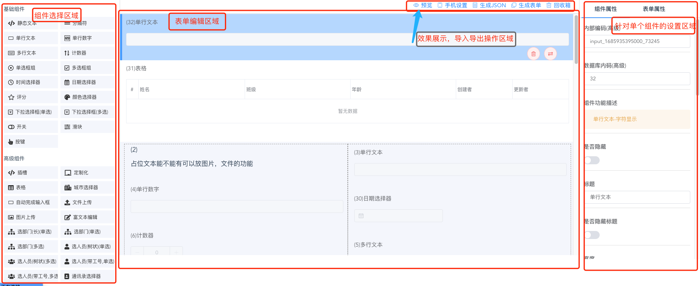  


### 拖拉拽
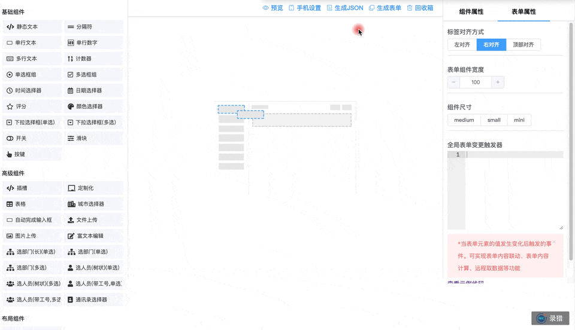  


### 丰富的组件

- 静态文本
- 分隔符
- 单行文本
- 单行数字
- 多行文本
- 计数器
- 单选框组
- 多选框组
- 时间选择器
- 日期选择器
- 评分
- 颜色选择器
- 下拉选择框(单选)
- 下拉选择框(多选)
- 开关
- 滑块
- 按键

- 插槽
- 定制化
- 表格
- 自动完成输入框
- 文件上传
- 图片上传
- 富文本编辑
- 级联选择


- 栅格布局 


### 单组件公共字段

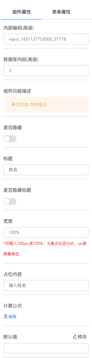  


| 参数 | 字段 | 描述 | 示例值 |
| --- | --- | --- | --- |
| 内部编码 | model | 返回对象的键值，既models的值 |  |
| 数据库内码 | keyindex | 存储在数据库中内码，OA系统中用 |  |
| 是否隐藏 | hide | 对填写值和标题是否进行隐藏 |  |
| 标题 | name | 该填写值的标题 |  |
| 是否隐藏标题 | hideTitle | 可以隐藏标题 |  |
| 宽度 | width | 组件的宽度 |  |
| 占位内容 | placeholder | 提示的内容 |  |
| 计算公式 | formula | 关联计算使用 |  |
| 默认值 | defaultValue | 该组件的默认值 |  |
| 校验 | pattern | 数据校验 |  |
| 标题宽度 | labelWidth | 标题的宽度设置，默认按全局表单 |  |
| 样式style | model | 个性化的样式描述 | font-weight:bold;border:2px solid; |
| 内置参数-高级 | inner_set_json | 对界面上不存在的设置进行配置（懂开发的人使用） |  |

配置后的数据结构
```javascript
{
    "tooltip": "单行文本-字符显示",
    "type": "input",
    "name": "姓名",
    "icon": "text-field",
    "options": {
        "width": "100%",
        "defaultValue": "",
        "required": true,
        "dataType": "",
        "pattern": "",
        "placeholder": "输入姓名",
        "formula": "",
        "remoteFunc": "func_1651127752000_27178",
        "remoteOptions": []
    },
    "key": "1651127752000_27178",
    "keyindex": 3,
    "model": "input_1651127752000_27178",
    "rules": [{
        "required": true,
        "message": "姓名必须填写"
    }],
    "hideTitle": false,
    "labelWidth": "",
    "style": "font-weight:bold;border:2px solid;",
    "hide": false,
    "inner_set_json": {
        "clearable": true
    }
}
```

### 针对组件个性化的设置
比如多选菜单的数据源配置

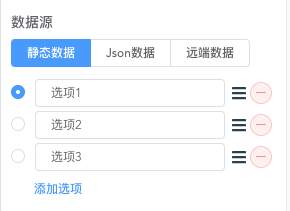  

比如日期组件

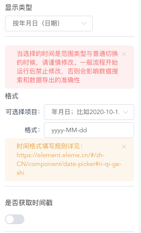  


### 计算公式
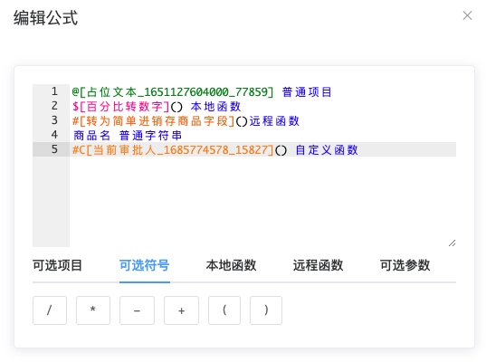  

比如表格组件

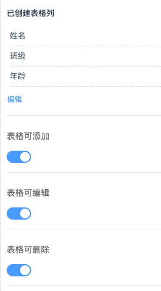  

等等

## 组件介绍

### 插槽组件

### 默认值的填写


### 参数


### 功能如何实现？？？

#### 数据填充
- 通过全局事件监听
- 远程函数与公式计算的混用


#### 属性变更
- 通过全局事件监听
- 增加一个属性变更触发器（待开发，像蓝凌）


## 高级功能（供开发者使用）

### button组件的点击click事件
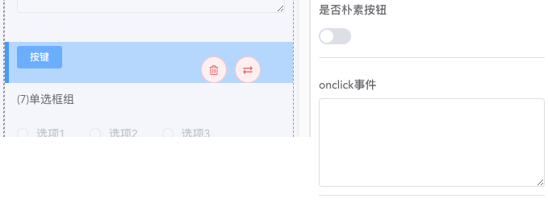  

```javascript
({
    "default": function ({
        buttonset,//当前button设置
        Models,//表单全部值
        FormConfig,//表单设置
        RecursiveFormList, //转换工具
        HttpRequest//http访问函数；来自axios
    }) {
        //隐藏某个元素
        RecursiveFormList(FormConfig.list, (ele) => {
            if (ele.key == '1651127760000_58621') {
                ele.hide = true;
            }
        })

        //通过连接后台填充数据
            HttpRequest({
                url: 'http://localhost:8098/api/sap/get_order_detail',
                data: {
                    dzycode: Models.input_1605333871000_63739
                },
                method: 'post'
            }).then(({
                data: req
            }) => {
                Models['table_1605333871000_63739'] = req.data
                //填充表格；
            }).catch(err => {
                console.log(err)
            })
    }
})
```
[查看参数如何配置](#handle_fun)
和全局触发的类似；


### 内置参数-高级

功能描述：项目是基于element-ui开发的。大部分配置都已经在组件中体现；但个别不常用的属性和事件没有进行配置；比如e-button里面的loading click属性

配置方法：

选中button组件->组件属性->最下面

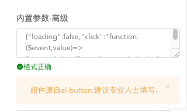  

```javascript
{
    "loading":false,
    "click":"function:($event,value)=> {alert(\"Button clicked!\");\n}"
}
```
如果参数是函数的话，要用function:函数 的字符串 方式

举例：
1. 对input组件增加长度限制和显示字数
{"maxlength":"10","show-word-limit":true}
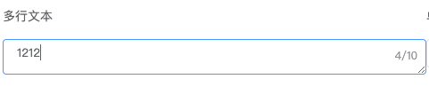  

2. 同样表格里面的元素也支持内置参数

下面的案例让表格中的日期时间支持范围输入
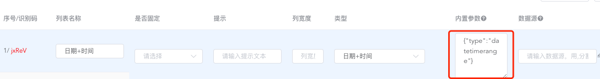  

```javascript
{"type":"datetimerange"}
```

效果：如下

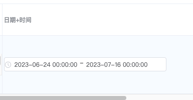  


下面的案例让表格中的菜单单选和单选框支持其他输入
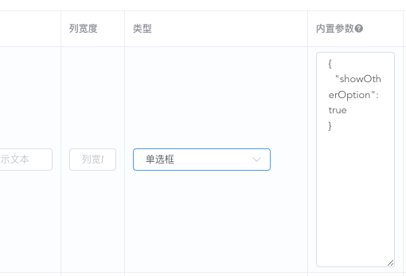  

```javascript
{
  "showOtherOption": true
}
```
效果：如下
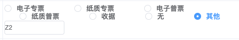  


### 全局表单变更触发器
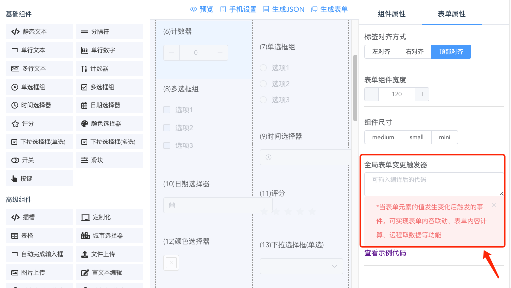  

```javascript
// 这是固定格式写法。一定要按此模式写函数
({
    "default": function ({
        nowFormItemSet,//当前表单设置
        nowValue,//当前值
        Models,//表单全部值
        FormConfig,//表单设置
        RecursiveFormList, //转换工具
        HttpRequest//http访问函数；来自axios
    }) {
        console.log('formitemset2', nowFormItemSet)

        if(nowFormItemSet==null){
            console.log('来自初始化表单初始化')
        }

        // nowFormItemSet.hide=true;

        console.log('FormConfig', FormConfig)


        //隐藏某个元素
        RecursiveFormList(FormConfig.list, (ele) => {

            if (ele.key == '1651127760000_58621') {
                ele.hide = true;
            }

        })

        if (nowFormItemSet.key == '1605333874000_56140') {
            HttpRequest({
                url: 'http://localhost:8098/api/sap/get_userinfo_by_dzycode',
                data: {
                    dzycode: nowValue
                },
                method: 'post'
            }).then(({
                data: req
            }) => {
                Models['input_1605333871000_63739'] = req.name
            }).catch(err => {
                console.log(err)
            })
        }

    }
})
```

- 案例一：根据元素值变化控制另外一个元素的显示隐藏
- 案例二：http拉取数据，填充table表格

### handle函数参数介绍
<a id="handle_fun"></a>

- nowFormItemSet：当前触发表单元素的设置
  - 示例数据
 ```javascript
{
    "tooltip": "单行文本-字符显示",
    "type": "input",
    "name": "单行文本",
    "icon": "text-field",
    "options": {
        "width": "100%",
        "defaultValue": "",
        "required": null,
        "dataType": null,
        "pattern": null,
        "placeholder": "",
        "formula": "",
        "isRange": null,
        "remoteFunc": "func_1685605890000_80032"
    },
    "rules": [],
    "key": "1685605890000_80032",
    "keyindex": 1,
    "model": "input_1685605890000_80032",
    "hideTitle": false,
    "labelWidth": null,
    "style": null,
    "hide": false,
    "matchCol": []
}
```  
- nowValue：当前值
- Models：表单全部值
```javascript
{
    "input_1685605890000_80032": "12121212"
}
```
- FormConfig表单设置
  - 示例数据
```javascript
{
    "list": [
        {
            "type": "placeholderhtml",
            "name": "静态文本",
            "icon": "code",
            "style": "margin: 10px 0;",
            "options": {
                "width": "100%",
                "height": "",
                "placeholderhtml": "静态文本",
                "remoteFunc": "func_1685605893000_8312",
                "isRange": null,
                "required": null,
                "dataType": null,
                "pattern": null
            },
            "key": "1685605893000_8312",
            "keyindex": 2,
            "model": "placeholderhtml_1685605893000_8312",
            "hideTitle": false,
            "labelWidth": null,
            "hide": false,
            "matchCol": []
        },
        {
            "tooltip": "单行文本-字符显示",
            "type": "input",
            "name": "单行文本",
            "icon": "text-field",
            "options": {
                "width": "100%",
                "defaultValue": "",
                "required": null,
                "dataType": null,
                "pattern": null,
                "placeholder": "",
                "formula": "",
                "isRange": null,
                "remoteFunc": "func_1685605890000_80032"
            },
            "rules": [],
            "key": "1685605890000_80032",
            "keyindex": 1,
            "model": "input_1685605890000_80032",
            "hideTitle": false,
            "labelWidth": null,
            "style": null,
            "hide": false,
            "matchCol": []
        }
    ],
    "remove_list": [],
    "config": {
        "labelWidth": 100,
        "labelPosition": "top",
        "xs_config": {
            "labelWidth": 180,
            "labelPosition": "top",
            "size": "medium",
            "rowMax": 1
        },
        "sm_config": {
            "labelWidth": 180,
            "labelPosition": "top",
            "size": "small",
            "rowMax": 2
        },
        "change_code": "({\n    \"default\": function ({\n        nowFormItemSet,//当前表单设置\n        nowValue,//当前值\n        Models,//表单全部值\n        FormConfig,//表单设置\n        RecursiveFormList, //转换工具\n        HttpRequest//http访问函数；来自axios\n    }) {\n        console.log('formitemset2', nowFormItemSet)\n\n        // nowFormItemSet.hide=true;\n\n        console.log('FormConfig', FormConfig)\n\n\n        //隐藏某个元素\n        RecursiveFormList(FormConfig.list, (ele) => {\n\n            if (ele.key == '1651127760000_58621') {\n                ele.hide = true;\n            }\n\n        })\n\n        if (nowFormItemSet.key == '1605333874000_56140') {\n            HttpRequest({\n                url: 'http://localhost:8098/api/sap/get_userinfo_by_dzycode',\n                data: {\n                    dzycode: nowValue\n                },\n                method: 'post'\n            }).then(({\n                data: req\n            }) => {\n                Models['input_1605333871000_63739'] = req.name\n            }).catch(err => {\n                console.log(err)\n            })\n        }\n\n    }\n})"
    }
}
```
- RecursiveFormList转换工具；可以递归遍历表单设置
- HttpRequest//http访问函数；来自axios


### 如何制作自定义组件

#### 编写组件

下载组件编写案例包

基础知识点：

组件使用的时候可以指定status 默认是 input

设计表单时的预览模式：design.preview

设计表单时的显示模式：design.show

填写模式：input

查看模式：read

如果你需要自定义的话，比如搜索表单：可以设置 status=read.search 


编写组件的几个方面：
1. 认识组件变量 cmixins的引入；可以读取到的数据包含 
   1. $attrs 
   2. $listeners 
   3. globalSet 
   4. globalValue 
   5. dataOptions 数据源 已经转换完成的数据;同时考虑改数据可能会变化。 this.$emit('initdataoptions', options);来实现重新触发；
   6. disabled 
   7. placeholder 
   8. options - 来源是表单和表格是有区别
   9. status_arr 
   10. status
2. onchange事件的反馈
3. sync_value与组件之间的交互。数据同步；关注数据的同步方向；
4. 组件各种状态disable,read,design.preview,desi下显示
5. _hide_show的写入
6.  set组件的编写
7.  组件打包
```javascript
import FEleCascader from './FEleCascader.vue';
Vue.component('fm-ele-cascader', FEleCascader);


import FEleCascaderSet from './FEleCascaderSet.vue';
Vue.component('fm-ele-cascader-set', FEleCascaderSet);
```
8.  添加组件到配置中去
在form_set.json 里面advanceComponents和 添加form.customlist
```javascript
{
advanceComponents:[
...,
 {
      "componentName": "fm-ele-cascader",
      "componentSet": "fm-ele-cascader-set",
      "type": "custom",
      "name": "级联",
      "icon": "chalkboard",
      "options": {
        "placeholder": "",
        "defaultValue": [],
        "componentName": "fm-ele-cascader",
        "cascader_set": {
          "show-all-levels": true,
          "collapse-tags": false,
          "separator": "/",
          "filterable": true,
          "expandTrigger": "hover",
          "multiple": false,
          "checkStrictly":false
        },
        "clearable": true,
        "disabled": false,

        "showLabel":false,
        "options":[],
        "sourceType": "json",
        "remoteUrlAlias": null,
        "jsonOptions": [],
        "remoteOptions": [],
        "props": {
          "value": "value",
          "label": "label",
          "children": "children"
        },
        "remoteFunc": ""
      },
      "blacklist": [
        "componentName",
        "showLabel"
      ]
    }
],

  "form": {
    "customlist": [
        ...
        {
        "usedplaces": [
          "form",
          "table"
        ],
        //使用范围：表单和表格；
        "n": "级联",
        "v": "fm-ele-cascader",
        "set": {
            //内容和上面的一致；唯一的区别在blacklist里面
          "componentName": "fm-ele-cascader",
          "componentSet": "fm-ele-cascader-set",
          "type": "custom",
          "name": "级联",
          "icon": "chalkboard",
          "options": {
            "placeholder": "",
            "defaultValue": [],
            "componentName": "fm-ele-cascader",
            "cascader_set": {
              "show-all-levels": true,
              "collapse-tags": false,
              "separator": "/",
              "filterable": true,
              "expandTrigger": "hover",
              "multiple": false,
              "checkStrictly":false
            },
            "clearable": true,
            "disabled": false,

            "showLabel":false,
            "options":[],
            "sourceType": "json",
            "remoteUrlAlias": null,
            "jsonOptions": [],
            "remoteOptions": [],
            "props": {
              "value": "value",
              "label": "label",
              "children": "children"
            },
            "remoteFunc": ""
          },
          "blacklist": [
            "showLabel"
            //注意此处少了componentName
          ]
        }
      }
      ...]

```
9.  组件加载方式
   - 页面加载
 ```javascript
  <script src="components/dist/js/FmEleCascader.js"></script>
 ```
   - 放入window.formSet.components_url 下的目录里面，会自动加载
 ```javascript
 "components_url": "components/dist/js/",
 ``` 
 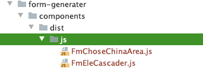  


## 附录
### 参数介绍
<a id="form_set_json"></a>
```javascript
// form_set.json
{

    //布局组件。设置了按此处显示；未设置按系统默认
    "layoutComponents": null,
    //基础组件。设置了按此处显示；未设置按系统默认
    "basicComponents": null,
    //高级组件。设置了按此处显示；未设置按系统默认
    "advanceComponents": [{
        "type": "blank",
        "tooltip": "插槽功能，可以引入自定义的组件，<template slot=\"blank\" slot-scope=\"scope\">xxx;slotname=blank是内部编码</template>",
        "name": "插槽",
        "icon": "code",
        "options": {
            "defaultType": "String"
        }
    }],
    //高级模式：可以修改表单model的键值对。一般给开发者开
    "is_advanced": true,
    //组件默认加载目录
     "components_url": "components/dist/js/",
    //手机端设置页面
    "mobile_test_url": "form-generater-mobile.html",
    //ace公式个性化
    "ace_formula_url": "/assets/js/mode-custom-bibao.js",
    //tinymce的中文配置
    "tinymce_language_url": "/dist/lib/tinymce/zh_CN.js",
    //表单配置
    "form": {
        //定制列表
        "customlist": [{
            "usedplaces": [
                "form"
            ],
            "n": "城市选择器",
            "v": "fm-chose-china-area",
            "set": {
                "componentName": "fm-chose-china-area",
                "type": "custom",
                "name": "城市选择器",
                "icon": "city",
                "options": {
                    "placeholder": "",
                    "defaultValue": {
                        "provinceName": null,
                        "cityName": null,
                        "regionName": null,
                        "provinceCode": null,
                        "cityCode": null,
                        "regionCode": null
                    },
                    "componentName": "fm-chose-china-area",
                    "chinaareaset": {
                        "provinceDisabled": false,
                        "cityDisabled": false,
                        "regionDisabled": false,
                        "showCity": true,
                        "showRegion": true
                    },
                    "width": 100,
                    "disabled": false
                }
            }
        }, ],
        //默认值填写。这个一般是oa中使用的。初始化时候填写；
        "defaultValue_format": [{
            "_id": {
                "$oid": "61cec2fb8494ef003d3b82e4"
            },
            "name": "当前时间{年-月-日}",
            "value": "${timeformat:YYYY-MM-DD}",
            "desc": "示例数据：2022-10-26",
            "components": [
                "input",
                "textarea",
                "time",
                "date",
                "text",
                "datetime",
                "fm-tinymce"
            ]
        }, ],
        //远程函数列表：接如php或nodejs等后台
        "funlist": [{
            "name": "简单进销存商品",
            "prefix": "",
            "api": "",
            "fields": [{
                    "name": "商品名",
                    "value": "name"
                },
                {
                    "name": "条形码",
                    "value": "barcode"
                },
                {
                    "name": "生产厂家",
                    "value": "producer"
                },
                {
                    "name": "简称",
                    "value": "nameforshort"
                },
                {
                    "name": "价格",
                    "value": "price"
                },
                {
                    "name": "成本",
                    "value": "cost"
                }
            ],
            "funlist": [{
                "placeholder": "转换[简单进销存]的商品字段，第一个参数是商品id，第二个参数是要转换的字段，使用方式实例：#[转为简单进销存商品字段](@[商品ID],商品名)",
                "funname": "转为简单进销存商品字段",
                "fun": "trans_samplejxc_by_wareid",
                "frontfun": "uri_merge_para0"
            }]
        }],
        //本地函数js
        "localfun": [{
                "placeholder": "百分比转换成数字,参数1为要转换的带有%的字符串，比如12.12%会转换0.1212",
                "funname": "百分比转数字",
                "funeval": "(paras)=>{\n                    console.log(paras);\n                    if((paras[0]+'').indexOf('%')!=-1){\n                        paras[0]=paras[0].replace(\"%\",\"\");\n                        paras[0]=paras[0]/100;\n                    }\n                    return paras[0];\n                }"
            },
            {
                "placeholder": "将输入的数据四舍五入后保留N位数，默认保留2位。参数1是要转换的数据，参数2是保留的位数，默认是2",
                "funname": "四舍五入保留小数",
                "funeval": "(paras)=>{\n                    console.log('paras',paras)\n                    \n                    let num = Number(eval(paras[0])).toFixed(paras.length>1?paras[1]:2)\n    \t\t        return num;\n                }"
            }
        ],
        "remoteurl": "http://localhost:8095/api/oa/form/remote_func/",
        "remotefun": [{
            "usedscope": [
                "EleAutoCompleteSample"
                //哪些组件可以使用
            ],
            "p": "",
            "n": "测试",
            "v": "test",//相当于从http://localhost:8095/api/oa/form/remote_func/test取数据
            "props": {
                "method": "post",
                "value": "value",
                "label": "label",
                "children": "children"
            }
        }, ]
    },
    //表格配置
    "table": {
        //远程函数：同表单的配置
        "funlist": [{
            "name": "简单进销存商品",
            "prefix": "",
            "api": "",
            "fields": [{
                    "name": "商品名",
                    "value": "name"
                },
                {
                    "name": "条形码",
                    "value": "barcode"
                },
                {
                    "name": "生产厂家",
                    "value": "producer"
                },
                {
                    "name": "简称",
                    "value": "nameforshort"
                },
                {
                    "name": "价格",
                    "value": "price"
                },
                {
                    "name": "成本",
                    "value": "cost"
                }
            ],
            "funlist": [{
                "placeholder": "转换[简单进销存]的商品字段，第一个参数是商品id，第二个参数是要转换的字段，使用方式实例：#[转为简单进销存商品字段](@[商品ID],商品名)",
                "funname": "转为简单进销存商品字段",
                "fun": "trans_samplejxc_by_wareid",
                "frontfun": "uri_merge_para0"
            }]
        }],
        //本地函数
        "localfun": [{
                "placeholder": "百分比转换成数字,参数1为要转换的带有%的字符串，比如12.12%会转换0.1212",
                "funname": "百分比转数字",
                "funeval": "(paras)=>{\n                    console.log(paras);\n                    if((paras[0]+'').indexOf('%')!=-1){\n                        paras[0]=paras[0].replace(\"%\",\"\");\n                        paras[0]=paras[0]/100;\n                    }\n                    return paras[0];\n                }"
            },
            {
                "placeholder": "将输入的数据四舍五入后保留N位数，默认保留2位。参数1是要转换的数据，参数2是保留的位数，默认是2",
                "funname": "四舍五入保留小数",
                "funeval": "(paras)=>{\n                    console.log('paras',paras)\n                    \n                    let num = Number(eval(paras[0])).toFixed(paras.length>1?paras[1]:2)\n    \t\t        return num;\n                }"
            }
        ],
        "remoteurl": "http://localhost:8095/api/oa/form/remote_func/",
        "remotefun": [
            {
                "usedscope": [
                    "DataSourceAdmin"
                ],
                "n": "简单进销存-仓库列表",
                "v": "sample-depots",
                "props": {
                    "method": "post",
                    "value": "value",
                    "label": "label",
                    "children": "children"
                }
            },
            {
                "usedscope": [
                    "EleAutoCompleteSample"
                ],
                "p": "输入商品名称，拼音，拼音首字母获取商品编码",
                "n": "简单进销存-商品编码",
                "v": "sample-wareid",
                "props": {
                    "method": "post",
                    "value": "value",
                    "label": "label"
                }
            }
        ]
    }
}
```


```javascript
 remoteFuncs: {
                        func_1649733158000_50817: (data) => {
                            return new Promise((resolve) => {
        resolve();
        console.log(data); // widget
    });


function func_1649733158000_50817(data) {
    return new Promise((resolve) => {
        resolve();
        console.log(data); // widget
    });
}
}
                        },
                    },
```


关键词：
低代码、拖拉拽、二开表单、之奇OA表单控件、